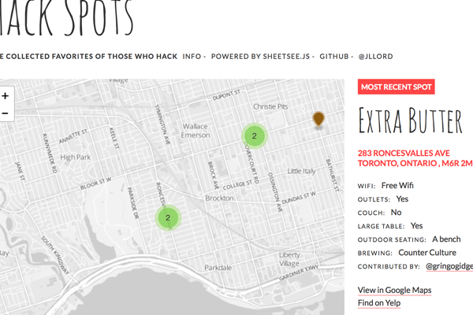

# Contributing!

Thanks for contributing or reading or opening this contributing doc! :)

## Add a Fork-n-Go project to the list on the site:

- Fork this repository
- Create a new branch
- Edit the `index.html` file with a new block of HTML with your additions.
 - It should look like the block below, just copy and paste this, change out the links and summary text and add it to `index.html` following the last `.examples .thirds` block in the `#examples` section.

```HTML
<div id="spreadsheet-map" class="examples thirds">
  <h2>Interactive locations from Spreadsheet</h2>
  
  <p>Connects to a Google Spreadsheet with coffee shop locations and details. An interactive map and table for searching the spots using <a href="http://jlord.github.io/sheetsee.js" target="_blank">Sheetsee.js</a>.  — By <a href="http://twitter.com/jllord" target="_blank">@jllord</a>.</p><a class="button" href="http://www.github.com/jlord/hack-spots" target="_blank">GitHub Repository</a>
  <a class="button-nested" href="http://jlord.github.com/hack-spots" target="_blank">Demo</a>
</div>
```

- Add a **600px x 400px** screenshot of the project to the `img/` folder and link to it in the HTML you created above.
  - If you have trouble with this (it can't be done via the web interface currently), you can always put a link to the image in your pull request and I can add it in.
- Make sure to give your `div` an `id` so people can link directly to that project (ie: _jlord.github.io/forkngo#project_)
- Commit and push (which happens automatically if you're doing it via the web interface) changes and make a pull request with a title and short description about the update.
- Woo!

**If you have any questions about this, [open an issue](https://github.com/jlord/forkngo/issues/new) and I'm happy to make it easier or clearer.**

**If you want to contribute to a project that is listed on this page, submit pull requests to its repository.**

### Thank you for helping out!
