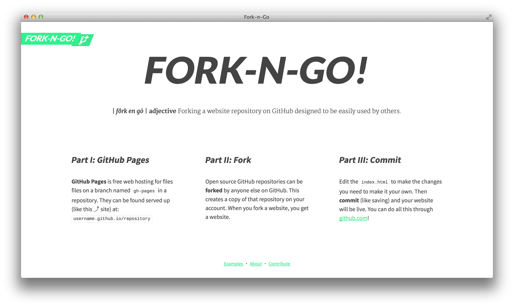
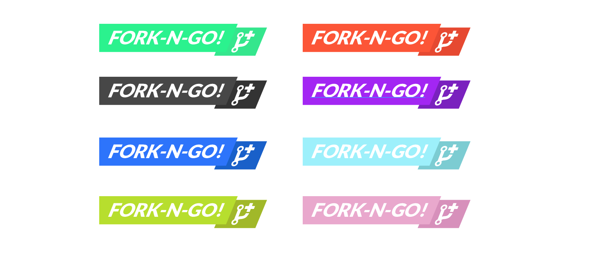

# Fork-n-Go!

A website listing and promoting fork-n-go style projects: [jlord.github.io/forkngo](http://jlord.github.io/forkngo).

## Fork-n-Go

These are website project repositories on GitHub that are designed to be hosted on GitHub Pages, meaning, whenever someone forks the repository and commits one change, they've got a live and hosted site!

If you've got a Fork-n-Go style project, [add it to the site](https://github.com/jlord/forkngo/blob/gh-pages/CONTRIBUTING.md). And grab a [badge](https://github.com/jlord/forkngo/tree/gh-pages/badges) from the folder if you'd like.

** Badges for you! Badges for you! Badges for you! **

---

### License: [BSD](license.md)
### I am a junior developer
### I am a hero
